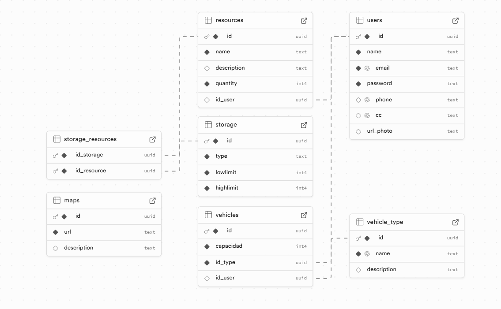

# 🚀 Marficient

[](https://github.com/Anarragan/Preficient)

Marficient es una aplicación web para la gestión de misiones en Marte. Permite a los usuarios gestionar recursos, vehículos, almacenamiento, mapas y datos de la NASA, facilitando la planificación y ejecución de exploraciones marcianas. 🌌

## ✨ Características

- 🔐 **Autenticación y Autorización**: Sistema de login con JWT y API Key.
- 📦 **Gestión de Recursos**: Inventario de recursos disponibles.
- 🏭 **Almacenamiento**: Gestión de almacenes con límites de capacidad.
- 🚗 **Vehículos**: Administración de tipos y unidades de vehículos.
- 🗺️ **Mapas**: Visualización y gestión de mapas de Marte.
- 🔭 **Integración con NASA**: Acceso a datos de la API de la NASA.
- 📊 **Dashboard**: Panel de control para monitoreo general.

## 🛠️ Tecnologías Utilizadas

### Backend
<p align="center">
  
  
  
  
  
  
</p>

- **NestJS**: Framework de Node.js para aplicaciones escalables.
- **TypeScript**: Lenguaje de programación tipado.
- **PostgreSQL**: Base de datos relacional (hospedada en Supabase).
- **JWT**: Autenticación basada en tokens.
- **Docker**: Contenedorización para fácil despliegue.
- **TypeORM**: ORM para interactuar con la base de datos.

### Frontend
<p align="center">
  
  
  
  
</p>

- **React**: Biblioteca para interfaces de usuario.
- **Vite**: Herramienta de construcción rápida.
- **TypeScript**: Lenguaje de programación tipado.
- **Tailwind CSS**: Framework de CSS utilitario.
- **shadcn/ui**: Componentes de UI reutilizables.

## Instalación y Configuración

### Prerrequisitos
- Node.js (versión 18 o superior)
- Docker y Docker Compose
- Cuenta en Supabase para la base de datos
- Clave de API de NASA

### Backend

1. Navega al directorio del backend:
   ```
   cd Backend
   ```

2. Instala las dependencias:
   ```
   npm install
   ```

3. Configura las variables de entorno:
   Crea un archivo `.env` en la raíz del backend con el siguiente contenido (ajusta los valores según tu configuración):
   ```
   PORT=5000
   NODE_ENV=development
   API_KEY=tu_api_key

   JWT_SECRET=tu_jwt_secret

   DB_HOST=tu_db_host
   DB_PORT=6543
   DB_NAME=postgres
   DB_USERNAME=tu_username
   DB_PASSWORD=tu_password

   NASA_API_KEY=tu_nasa_api_key
   ```

4. Ejecuta la base de datos con Docker:
   ```
   docker-compose up -d
   ```

5. Ejecuta las migraciones o seed si es necesario:
   ```
   npm run seed
   ```

6. Inicia el servidor:
   ```
   npm run start:dev
   ```

El backend estará disponible en `http://localhost:5000`.

### Frontend

1. Navega al directorio del frontend:
   ```
   cd Frontend
   ```

2. Instala las dependencias:
   ```
   npm install
   ```

3. Inicia el servidor de desarrollo:
   ```
   npm run dev
   ```

El frontend estará disponible en `http://localhost:5173` (puerto por defecto de Vite).

## Uso

1. Accede al frontend en tu navegador.
2. Regístrate o inicia sesión.
3. Navega por las diferentes secciones: Dashboard, Recursos, Vehículos, Mapas, etc.
4. Utiliza la API del backend para integraciones adicionales.

## Estructura del Proyecto

```
Marficient/
├── Backend/
│   ├── src/
│   │   ├── modules/
│   │   │   ├── auth/
│   │   │   ├── maps/
│   │   │   ├── nasa/
│   │   │   ├── resources/
│   │   │   ├── storage/
│   │   │   ├── storage_resources/
│   │   │   ├── users/
│   │   │   ├── vehicle_type/
│   │   │   └── vehicles/
│   │   └── ...
│   ├── docker-compose.yml
│   ├── Dockerfile
│   └── package.json
├── Frontend/
│   ├── src/
│   │   ├── components/
│   │   ├── pages/
│   │   ├── hooks/
│   │   └── ...
│   └── package.json
└── README.md
```

## Base de Datos

El esquema de la base de datos incluye las siguientes tablas principales:

- `users`: Información de usuarios.
- `resources`: Recursos disponibles.
- `storage`: Almacenes con límites.
- `storage_resources`: Relación entre almacenamiento y recursos.
- `vehicle_type`: Tipos de vehículos.
- `vehicles`: Vehículos específicos.
- `maps`: Mapas de Marte.

### Diagrama Entidad-Relación (DER)


Para más detalles, consulta el archivo `seed.sql` en el directorio del backend.

## Contribución

1. Fork el proyecto.
2. Crea una rama para tu feature (`git checkout -b feature/nueva-funcionalidad`).
3. Commit tus cambios (`git commit -am 'Agrega nueva funcionalidad'`).
4. Push a la rama (`git push origin feature/nueva-funcionalidad`).
5. Abre un Pull Request.

## Licencia

Este proyecto está bajo la Licencia MIT. Ver el archivo `LICENSE` para más detalles.

## Contacto

Para preguntas o soporte, contacta al equipo de desarrollo.